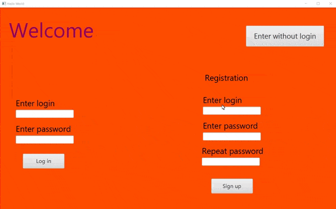
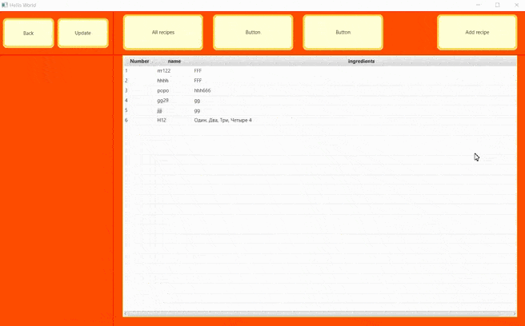

# RecipeMaster
Project RecipeMaster
Программа для создания и хранения рецептов

Версия java - 11 (выбрана для более коректной работы JavaFx)
Графический интерфейс реализован на JavaFx версии 11
Подключена база данных, субд - MySQL
Приложение выполнено на основе паттерна MVC

Добавлена возможность многопоточной работы, для обращение к БД. Реализовано через ExecutorService
(в классе DatabaseHandler)

Добавлено логирование
(в классах: Main,DatabaseProcess,MainProcess)

* Создание нового аккаунта и вход через системный

* Создание рецепта

* Просмотр рецепта и редактирование

* Удаление рецепта

